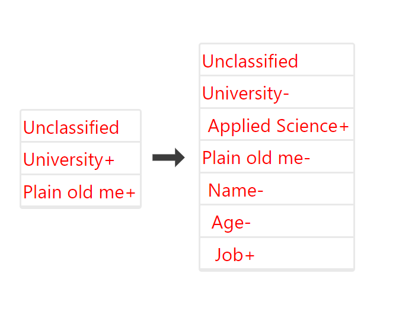

# react-simple-treeview
Super minimal treeview react component build with flexibility in mind and 0 external dependencies.
```
npm i --save react-simple-treeview
```

### Using the component.

```javascript
import NestedList from 'react-simple-treeview';

const data = [
  {
    title: 'Unclassified'
  },
  {
    title: 'University',
    data: [
      {
        title: 'Applied Science',
        data: []
      }
    ]
  },
  {
    title: 'Plain old me',
    data: [
      {
        title: 'Name',
        data: [
          {
            title: 'Age',
            data: [
              {
                title: 'Job',
                data: []
              }
            ]
          }
        ]
      }
    ]
  }
];
  
const listStyle = {
  listWrapper: {
    display: 'flex',
    flexDirection: 'column',
    border: '2px solid #e9e9e9',
    borderRadius: '4px',
  },
  listItem: {
    padding: '4px',
    borderBottom: '2px solid #e9e9e9',
    color: 'red'
  }
}

<NestedList list={data} leftOffset={5} styles={{...listStyle}} />
```
### How it looks


### Component props

| props | default | desc
|------|------|------
|list| [ ]| Array of objects to render as an expandable tree. Initial list data passed must have the same format as in the example (`title` for list items name and `data` for the inner expandable list)
|leftOffset| Number | Pixels in numbers that is applied as left padding. Every nested level's padding is increased by this amount with respect to its outer nested level. 
|styles| { } | Styles to be applied to list container (`listWrapper`) and items (`listItem`)
